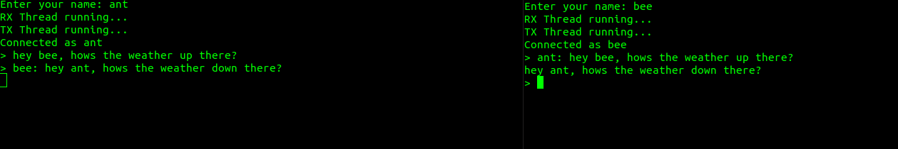
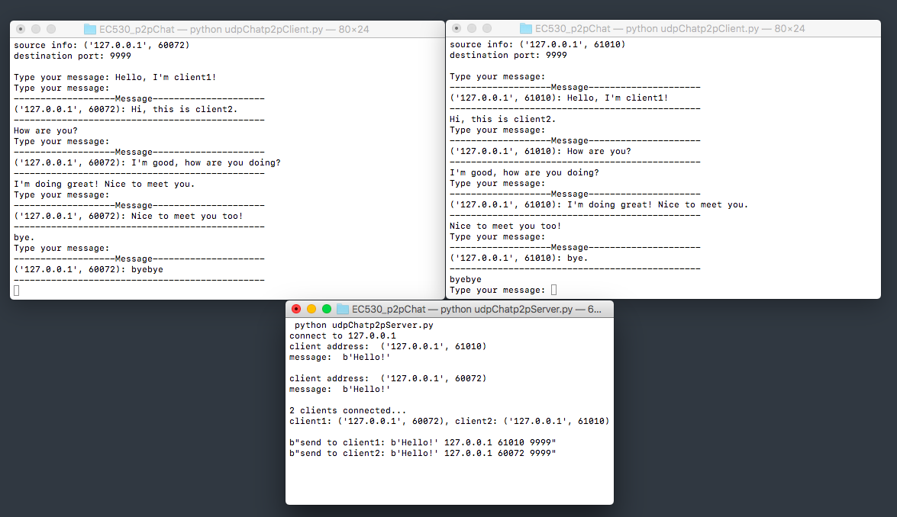

# *EC530_p2pChat*

This is a repo for the peer to peer hackathon

## *Architecture*
- One of the programs implements a direct TCP (Transfer Control Protocol) connection with no intermediate server.
- The other program used UDP (User Datagram Protocol) with a routing server to connect two users together, after the
server has been used, it does not participate in the communication anymore.

## *Code*
- `TCP_client.py`: Single file for a TCP client. When two users run the program, 
they can connect to each other and send messages. The sending and receiving of messages
is handles with threads.
- `udpChatp2pServer.py`: File for UDP server. This script will help the two clients to connect
to each other.
- `udpChatp2pClient.py`: File for UDP client. After the two clients connected to the server, the server 
sends the corresponding ip address and port. Then the clients can send and receive message to each other.
The receiving of messages is handle with threads

## *Screenshots*
- The example below shows the TCP communication between 2 peers
opened in different terminals communicating together. They are assigned
a name upon initialization based on user input.
>

- The following shows the UDP communication between 2 peers.
One receives messages with the sender's ip address and port.
>

